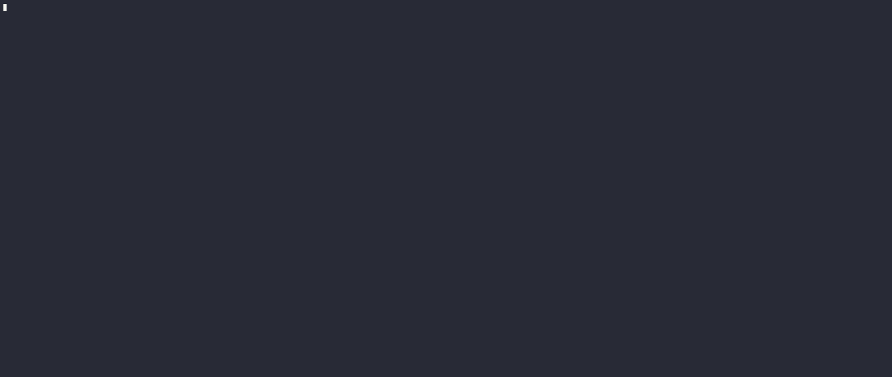

# Agentflow


Agentflow is an open-source execution engine for AI workers.

Think of it as Kubernetes for AI agents — you bring the worker, Agentflow handles
scheduling, lifecycle, cancellation, observability, and scale.

> "The valuable layer is not discovering agents. It is running them safely,
> composing them reliably, and scaling them predictably."

---

## The Problem

Teams building AI systems today face the same infrastructure problems repeatedly:

- No standard deployment unit for AI workers
- Brittle glue code stitching agents together
- No reliable retry, cancellation, or failure semantics
- Poor observability into what agents are actually doing
- Tight coupling to Python frameworks and specific SDK ecosystems
- No governance — cost controls, audit trails, access policies

Agentflow solves the infrastructure layer so you can focus on the worker logic.

---

## Core Concepts

**Worker** — an AI agent packaged as a Docker container with a typed
input/output contract. Language agnostic. Bring Go, Python, Node, Rust — anything.

**Task** — a unit of work dispatched to a worker. Has a lifecycle:
`pending → running → completed / failed / cancelled`.

**Workflow** — a directed acyclic graph (DAG) of tasks. Agentflow resolves
dependencies and schedules tasks in the correct order, running independent
tasks in parallel automatically.

**Worker Pool** — a bounded pool of concurrent executors. Provides
backpressure — when the pool is at capacity, new submissions are rejected
immediately rather than blocking indefinitely.

---

## Architecture
[Architecture Diagrams](docs/agentflow_architecture.md)

application structure
```
cmd/agentflow/
    main.go                 — entry point

internal/
    engine/
        dag.go              - Task Graph: Topological sorting of tasks
        executor.go         - Executor: Initializes worker pool, runs waves of tasks
        pool.go             — WorkerPool: Submit, Start, drain on cancellation
        worker.go           — worker: run with context-aware cancellation

    state/
        task.go             — Task, TaskStatus, state machine with transition guards

    manifest/               — YAML workflow parser (coming in v0.2)
    runtime/                — Docker agent runtime (coming in v0.2)

pkg/
    logger/
        logger.go           — structured transition logging
```

---

## What's Built

### (v0.1)

- [x] Concurrent worker pool with bounded concurrency
- [x] Context-aware cancellation — workers stop cleanly mid-execution
- [x] Enforced state machine — invalid transitions are rejected
- [x] Per-task mutex — tasks transition safely under concurrent access
- [x] Backpressure via non-blocking Submit — pool rejects when at capacity
- [x] Clean shutdown — no leaked goroutines, resultChan closes deterministically
- [x] Structured execution logging

### (v0.2)

- [x] Resolve task dependencies via `DependsOn []string`
- [x] Topological sort for execution ordering
- [x] Parallel execution of independent tasks
- [x] Block tasks until all dependencies complete
---

## Roadmap

**v0.3 — Manifest Parser**
- YAML workflow definitions
- Template expressions (`{{ trigger.topic }}`)
- Schema validation

**v0.4 — Docker Agent Runtime**
- Spawn Docker containers as workers
- Pass typed input via A2A protocol
- Collect output, enforce resource limits

**v0.5 — Observability**
- Full execution traces per workflow
- Token usage and cost tracking
- Failure root-cause analysis

**Forge — Managed Cloud**
- Hosted Agentflow clusters
- Agent registry
- Workflow marketplace
- Usage-based billing

---

## Getting Started

```bash
git clone https://github.com/surgeedidit/agentflow
cd agentflow
go mod tidy
go run cmd/agentflow/main.go
```

Expected output:

```
[t-1] [pending] -> [running]    (worker 1)
[t-2] [pending] -> [running]    (worker 2)
[t-3] [pending] -> [running]    (worker 3)
[t-1] [running] -> [completed]  (worker 1)
...
All done!
```

---

## Design Principles

**Determinism at the orchestration layer** — even though AI workers are
probabilistic, execution control is deterministic. The engine always
behaves predictably.

**Reliability over intelligence** — Agentflow does not make AI workers
smarter. It makes them operationally reliable.

**Language agnostic** — workers are Docker containers. The engine does
not care what is inside.

**Infrastructure first** — marketplace, registry, and discovery are
emergent layers. The execution engine is the product.

---

## Built With

- [Go](https://golang.org) — runtime and engine
- Docker — worker sandboxing (v0.4)
- A2A Protocol — agent communication standard (v0.4)
- OpenTelemetry — distributed tracing (v0.5)

---

## License

MIT
